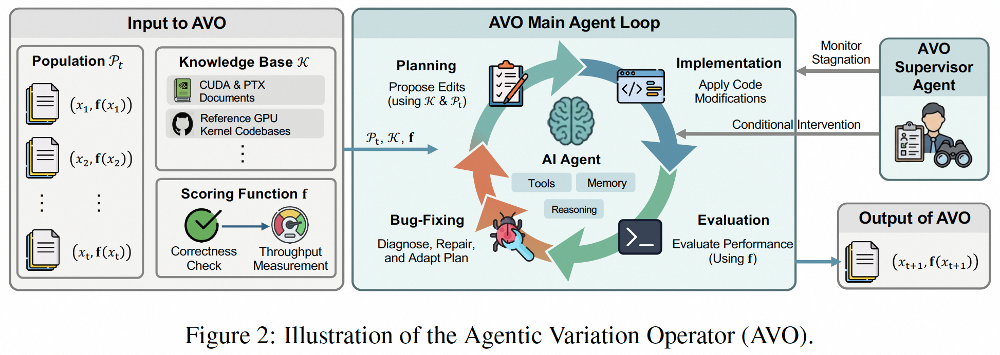

# AVO: Agentic Variation Operators for Autonomous Evolutionary Search

**Authors**: Andrew Kerr, Haicheng Wu, Yang Xu, Yu-Jung Chen, Hanfeng Chen, Aditya Kane, Ronny Krashinsky, Ming-Yu Liu, Vinod Grover, Luis Ceze, Roger Bringmann, John Tran, Wei Liu, Fung Xie, Michael Lightstone, Humphrey Shi  
**Institution**: NVIDIA, University of Washington, and collaborators  
**Conference**: arXiv  
**Year**: 2026  
**Paper Link**: [arXiv:2603.24517](https://arxiv.org/abs/2603.24517)  

Evolutionary Search
Attention Kernels
Agentic Optimization

## Background

AVO starts from a critique of prior LLM-in-the-loop evolutionary search. In earlier systems, the language model usually serves only as a candidate generator inside a rigid pipeline: the framework decides how to sample parents, when to evaluate, and how to manage the population. That setup limits what the model can actually discover, especially on heavily optimized GPU kernels where meaningful progress requires iterative debugging, profiling, documentation lookup, and strategy revision rather than one-shot generation.

The paper studies this problem on forward-pass attention kernels for NVIDIA Blackwell GPUs. This is an intentionally hard target: both cuDNN and FlashAttention-4 already represent months of expert optimization, so any further gain requires discovering micro-architectural improvements rather than only broad algorithmic changes. AVO argues that the variation operator itself should become agentic.

**Key Takeaways**

- AVO elevates the LLM from candidate generator to autonomous variation operator inside evolutionary search.
- The agent can inspect lineage, consult a knowledge base, run tools, validate kernels, and revise its own optimization plan before committing a new version.
- On Blackwell B200 GPUs, AVO reports up to 3.5% gains over cuDNN and up to 10.5% over FlashAttention-4 on multi-head attention, with rapid transfer to grouped-query attention.

## Methodology

AVO replaces the usual `Sample -> Generate` variation pipeline with a single autonomous agent invocation. Instead of handing a selected parent to an LLM and taking its first answer as the candidate, AVO gives the agent access to the full lineage of prior kernels, a domain-specific knowledge base, and the evaluation function. Within one variation step, the agent can compare previous versions, inspect profiler outputs, consult hardware documentation, attempt edits, diagnose failures, and only commit a new version once it passes correctness checks and matches or improves the best score so far.

The current paper studies a single-lineage continuous evolution setting. That choice isolates the effect of the agentic variation operator itself rather than mixing it with archive or island management choices. Over a seven-day run, the agent autonomously maintains progress through self-supervision: when it stalls or enters unproductive loops, a supervisory mechanism reviews the trajectory and redirects exploration toward new candidate directions.

### System Overview

| Component | Input | Output | Role |
| --- | --- | --- | --- |
| Agentic Variation Operator | Prior lineage, knowledge base, evaluation utilities | New candidate kernel version | Replaces fixed mutation/crossover with an autonomous optimization loop |
| Lineage `P_t` | Prior committed kernels and scores | Search context | Lets the agent revisit earlier ideas and reason over historical progress |
| Knowledge Base `K` | Documentation, reference kernels, hardware guides | External expertise | Provides domain-specific background for architecture-aware edits |
| Scoring Function `f` | Candidate kernel execution | Correctness and throughput score vector | Filters invalid kernels and measures hardware-level payoff |
| Self-Supervision Mechanism | Evolution trajectory and stagnation signals | New optimization directions | Prevents the run from stalling or looping on unproductive edits |

### AVO vs. Prior Evolutionary Pipelines

| Prior Evolutionary Search | AVO |
| --- | --- |
| LLM is confined to candidate generation | Agent owns the entire variation step |
| Sampling and evaluation are fixed by the framework | Agent can decide when to inspect, test, and revise |
| Typically one output per invocation | Multiple internal edit-evaluate-debug cycles per committed step |
| Limited ability to use tools or documentation | Direct access to references, profiling feedback, and tool use |

### Key Design Choices

- The agent is a general-purpose coding agent, not a kernel-only specialist, and no task-specific model retraining is required.
- A new version is committed only if it is correct and at least matches the best benchmark score so far.
- The lineage persists as a sequence of git commits, which preserves state continuity across long-running autonomous search.
- The methodology is orthogonal to population structure and could, in principle, be extended beyond the single-lineage regime explored here.

## Experiment

### Experimental Setup

| Item | Value |
| --- | --- |
| Target Hardware | NVIDIA B200 (Blackwell) |
| Software Stack | CUDA 13.1, PyTorch 2.10.0 |
| Kernel Target | Forward-pass attention |
| Precision / Head Dim | BF16, head dimension 128 |
| Main MHA Config | 16 heads, causal and non-causal |
| GQA Configs | 32 query heads with group sizes 8 and 4 |
| Baselines | cuDNN 9.19.1 and FlashAttention-4 |
| Search Duration | 7 days continuous autonomous evolution |

### Headline Results

| Task | Baseline Comparison | Reported Gain |
| --- | --- | --- |
| Multi-Head Attention | vs. cuDNN | Up to +3.5% |
| Multi-Head Attention | vs. FlashAttention-4 | Up to +10.5% |
| Grouped-Query Attention | vs. cuDNN | Up to +7.0% |
| Grouped-Query Attention | vs. FlashAttention-4 | Up to +9.3% |
| Peak MHA Throughput | BF16 on B200 | Up to 1668 TFLOPS |

These numbers are especially notable because the target baselines are already expert-engineered attention kernels on the newest GPU generation. The result is not that AVO merely approaches strong baselines, but that it exceeds them in the reported benchmarked configurations.

### Evolution Trajectory

| Search Statistic | Value |
| --- | --- |
| Continuous evolution time | 7 days |
| Successful committed kernel versions | 40 |
| Explored optimization directions | 500+ |
| GQA transfer effort | About 30 minutes autonomous adaptation |

The trajectory analysis shows that progress is not smooth or incremental at every step. The paper emphasizes discrete jumps, diminishing returns, and long-running search behavior rather than a single-shot lucky outcome. That profile is consistent with the claim that AVO is functioning as a true autonomous variation operator rather than a prompt wrapper around a fixed optimizer.

### Agent-Discovered Optimizations

| Optimization | Reported Impact | Main Idea |
| --- | --- | --- |
| Branchless accumulator rescaling | +8.1% geomean on non-causal, +1.6% on causal | Removes branch divergence and replaces blocking fence with lighter synchronization |
| Correction / MMA pipeline overlap | Positive throughput gain | Overlaps normalization work with later tensor-core compute stages |
| Register rebalancing across warp groups | +2.1% geomean on non-causal | Redistributes registers from low-pressure to critical-path warp groups |

The most interesting aspect of these optimizations is that they are micro-architectural rather than cosmetic. They involve reasoning jointly about synchronization, memory ordering, warp specialization, pipeline overlap, and register allocation. This is exactly the type of multi-factor hardware reasoning that fixed mutation operators are bad at expressing.

## Limitation

AVO is impressive, but the paper studies a very specific and unusually favorable regime: one high-value kernel family, one top-end hardware generation, and a long continuous evolution budget.

| Limitation | Why It Matters |
| --- | --- |
| Attention-only evaluation | The paper does not yet show the same level of success on a broad operator benchmark beyond attention |
| Single-lineage setting | Population-scale effects and archive-based evolutionary management are left for future work |
| Long optimization horizon | Seven days of autonomous search is powerful but expensive, which may limit practical deployment |
| Hardware specialization | The strongest results are tied to Blackwell B200 and attention kernels, so generalization to other architectures remains open |
| Agent complexity is high | Tool use, persistent memory, supervision, and iterative diagnosis increase system overhead compared with simpler evolutionary methods |

---

*Reading date: 2026-04*
*Note status: Completed*
