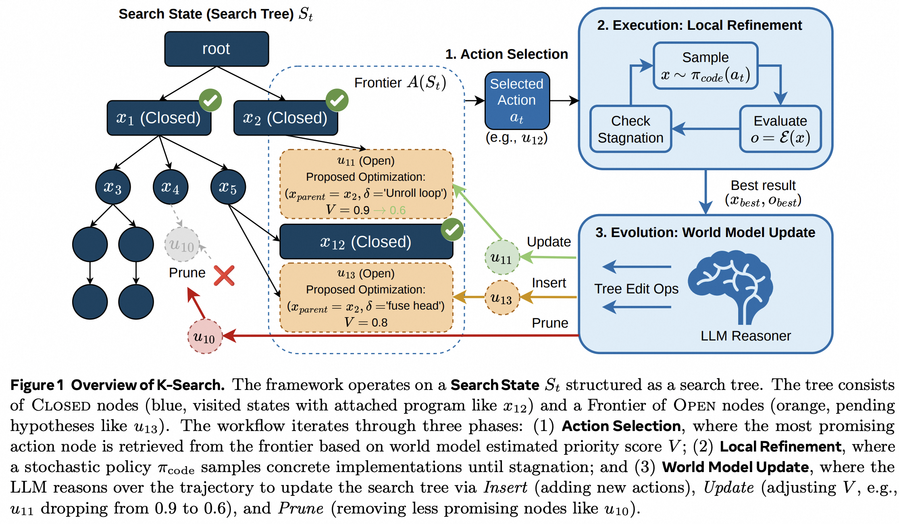

# K-Search: LLM Kernel Generation via Co-Evolving Intrinsic World Model

**Authors**: Shiyi Cao, Ziming Mao, Joseph E. Gonzalez, Ion Stoica  
**Institution**: UC Berkeley  
**Conference**: arXiv  
**Year**: 2026  
**Paper Link**: [arXiv:2602.19128](https://arxiv.org/abs/2602.19128)  

World Model
Kernel Search
FlashInfer

## Background

K-Search targets a limitation shared by many LLM-based kernel optimizers: they usually treat the language model as a stochastic code generator inside a heuristic search loop. That works for local rewrites, but it breaks down on kernels that need coordinated, multi-step structural changes where intermediate versions may be wrong, slow, or temporarily less promising before the final optimization emerges.

The paper argues that the missing piece is explicit planning. Instead of coupling high-level optimization intent directly to low-level code generation, K-Search introduces a co-evolving intrinsic world model that maintains an evolving search tree over optimization ideas. This turns kernel generation into a planning problem over states and actions rather than a sequence of isolated prompt-response samples.

**Key Takeaways**

- K-Search decouples algorithmic planning from low-level program instantiation by treating the LLM as a co-evolving world model.
- The search state is explicit and tree-structured, with priority-scored frontier actions that can be inserted, updated, or pruned over time.
- Across FlashInfer kernels, K-Search reports an average 2.10x improvement over OpenEvolve, an average 2.21x improvement over ShinkaEvolve, and up to 14.3x gain on challenging MoE kernels.

## Methodology

K-Search starts from the observation that many failed search trajectories are not bad because the high-level idea is wrong, but because a particular low-level instantiation is temporarily buggy or incomplete. Standard heuristic evolutionary search tends to discard those promising ideas too early. K-Search addresses this by separating the optimization plan from the implementation: the world model reasons over abstract optimization intents, while a separate code-generation policy performs local refinement until it stalls.

The search state is maintained as an explicit tree with Closed nodes for actions that have been explored and Open nodes for pending optimization hypotheses. Each open node stores a parent program, a natural-language optimization intent, and a priority score. At each iteration, the system selects the highest-priority frontier action, samples implementations locally until stagnation, evaluates them, and then updates the world model so it can insert new actions, revise priorities, or prune dead branches.

### System Overview

| Component | Input | Output | Role |
| --- | --- | --- | --- |
| World Model | Search state, action history, execution feedback | Updated search tree | Maintains beliefs about promising optimization directions |
| Search State | Current frontier plus closed nodes | Structured planning context | Represents what has been tried, what is pending, and which directions look promising |
| Action Selection | Frontier actions with priority scores | Next optimization intent | Chooses the next high-level plan to instantiate |
| Local Refinement Policy | Selected action and parent program | Concrete kernel candidates | Samples low-level implementations until stagnation |
| Evaluator | Candidate kernel execution | Correctness and speedup feedback | Determines whether the action should be expanded, revised, or abandoned |

### Search State Representation

| Element | Meaning |
| --- | --- |
| Closed node | A visited action whose local refinement has completed, with the best attached program |
| Open node | A pending action proposal on the frontier |
| Proposed optimization tuple | `(x_parent, delta)` linking a parent kernel to a natural-language optimization intent |
| Priority score `V` | World-model estimate of how promising that action is |
| Tree edit operations | `Insert`, `Update`, and `Prune` over frontier actions |

### Key Design Choices

- High-level planning and low-level instantiation are explicitly separated.
- Local refinement protects good ideas from being discarded because of transient syntax or implementation failures.
- The world model co-evolves through in-context learning from accumulated execution feedback.
- The search process uses a fixed evaluation budget, so planning quality matters directly for sample efficiency.

## Experiment

### Experimental Setup

| Item | Value |
| --- | --- |
| Workload Family | Complex kernels from FlashInfer |
| Representative Kernels | GQA, MLA, MoE kernels |
| Additional Task | GPUMode TriMul |
| Main Comparison Targets | OpenEvolve and ShinkaEvolve |
| Hardware | Hopper- and Blackwell-class NVIDIA GPUs, including H100 for TriMul and Hopper/Blackwell settings in kernel analyses |
| Objective | Speedup relative to strong SoTA reference baselines |
| Search Budget | Fixed evaluation budget `B` over candidate programs |

### Headline Results

| Benchmark / Task | Reported Result |
| --- | --- |
| FlashInfer kernel set | 2.10x average improvement over OpenEvolve |
| FlashInfer kernel set | 2.21x average improvement over ShinkaEvolve |
| Complex MoE kernel | Up to 14.3x gain over OpenEvolve |
| GPUMode TriMul on H100 | 1030 us geometric-mean latency, state-of-the-art result |

The main result is not only that K-Search wins on average, but that it does so on kernels requiring coordinated structural changes. The large MoE gain is especially important because it shows the method is not limited to small local cleanups. The TriMul result further suggests that the search procedure generalizes outside the FlashInfer kernel family.

### Representative Kernels

| Kernel | Architecture | Challenge |
| --- | --- | --- |
| MLA Paged Prefill | Hopper | Requires split CKV/KPE handling, bandwidth-aware optimization, and efficient causal attention |
| MLA Paged Decode | Hopper | Latency-bound at low batch sizes and sensitive to split strategy and memory reuse |
| GQA Paged Decode | Hopper | Memory-bound grouped-query attention requiring KV reuse and pipelined gather |
| MoE kernels | Blackwell / modern NVIDIA GPUs | Complex expert routing and FFN structure with large structural optimization space |

### Why It Works

| Mechanism | Observed Benefit |
| --- | --- |
| Tree-structured planning | Preserves promising high-level ideas even if early implementations are flawed |
| Local refinement to stagnation | Avoids abandoning an intent after only one bad sample |
| Co-evolving world model | Lets the system recalibrate priorities based on actual outcomes |
| Adaptive planning over sequence splits and pipelines | Produces hardware-aware strategies that differ across kernel structures |

The case studies in the paper make this concrete. For MLA paged decode, K-Search adapts split strategy to sequence length, keeps query vectors in registers instead of shared memory, and overlaps memory and compute more aggressively than the evolutionary baselines. These are coordinated structural improvements rather than isolated line edits.

## Limitation

K-Search is a strong argument for planning-centric kernel search, but it also depends on a heavier and more explicit search state than simpler evolutionary pipelines.

| Limitation | Why It Matters |
| --- | --- |
| Search state is more complex than heuristic evolution | Maintaining and editing an explicit tree adds engineering overhead |
| Strong results are shown on complex but still selected kernels | The paper emphasizes hard kernels from FlashInfer rather than a broad commodity benchmark alone |
| Heavy reliance on evaluation feedback | The approach still needs compilation and execution budget to co-evolve the world model effectively |
| Metadata extraction is partially incomplete in the converted source | Author and institution recovery from the arXiv conversion is noisier than ideal |
| Broader generality remains open | The core idea is promising, but extending the same world-model planning approach to wider domains still needs more evidence |

---

*Reading date: 2026-04*
*Note status: Completed*
