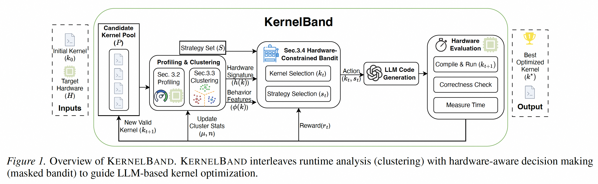

# KernelBand: Steering LLM-based Kernel Optimization via Hardware-Aware Multi-Armed Bandits

**Authors**: Dezhi Ran, Shuxiao Xie, Mingfang Ji, Anmin Liu, Mengzhou Wu, Yuan Cao, Yuzhe Guo, Hao Yu, Linyi Li, Yitao Hu, Wei Yang, Tao Xie  
**Institution**: Peking University  
**Conference**: arXiv  
**Year**: 2025  
**Paper Link**: [arXiv:2511.18868](https://arxiv.org/abs/2511.18868)  

Bandit Search
Hardware-Aware
Triton Optimization

## Background

KernelBand starts from a precise diagnosis of why LLM-based kernel optimization is hard. Code models are good at generating plausible and often functionally correct code, but kernel optimization is not mainly a generation problem. It is a search problem over a large, discontinuous performance landscape where many candidate transformations are useless, invalid, or locally attractive but globally poor.

The paper argues that this creates a mismatch between what code LLMs are trained to do and what high-performance kernel optimization actually requires. Instead of relying on heuristic reflection or unguided trial-and-error, KernelBand formulates kernel optimization as a contextual multi-armed bandit problem that explicitly balances exploration and exploitation under hardware constraints.

**Key Takeaways**

- KernelBand reframes LLM-based kernel optimization as a structured search problem instead of a pure generation task.
- The framework uses runtime clustering and hardware-aware pruning to make an expanding action space tractable.
- Across TritonBench-G, three NVIDIA GPUs, and four code LLMs, KernelBand consistently outperforms prior agentic baselines and improves both speedup and Fast@1.

## Methodology

KernelBand models optimization as iterative frontier expansion. Starting from a naïve kernel, the system maintains a frontier of promising kernels and repeatedly decides which kernel to expand with which optimization strategy. That decision is cast as a contextual bandit rather than a full RL problem because optimization trajectories are relatively short, rewards are immediately informative, and UCB-style bandits provide clearer sample-efficiency guarantees.

The main technical challenge is that the action space grows over time. Each action is a pair of an existing kernel and an optimization strategy, so the number of possible actions expands as new kernels are discovered. KernelBand addresses this through three coordinated mechanisms: runtime behavior characterization, dynamic clustering, and a hardware-constrained bandit policy.

### System Overview

| Component | Input | Output | Role |
| --- | --- | --- | --- |
| Runtime Behavior Characterization | Candidate kernel execution | Behavioral vector and hardware signature | Encodes bottlenecks and execution traits for downstream decision making |
| Dynamic Clustering | Frontier of candidate kernels | Kernel clusters | Groups kernels with similar optimization responses so experience can be shared |
| Hardware-Constrained Bandit Policy | Clustered frontier plus strategy set | Next cluster-strategy decision | Balances exploration and exploitation while masking invalid or low-potential strategies |
| LLM Transformation Engine | Selected kernel and optimization strategy | New candidate kernel | Applies code transformations such as tiling or vectorization |
| Profiling-Guided Pruning | Nsight Compute throughput signals | Valid strategy mask | Filters out actions targeting already saturated resources |

### Core Design

| Design Element | What It Uses | Why It Matters |
| --- | --- | --- |
| Behavioral feature vector `phi(k)` | Normalized time, registers, shared memory, block size, occupancy | Lets the system cluster kernels with similar optimization behavior |
| Hardware signature `h(k)` | DRAM, L2, and SM throughput from Nsight Compute | Identifies dominant bottlenecks for pruning |
| Periodic re-clustering | K-Means over behavior vectors | Keeps the expanding frontier manageable and shares statistics across similar kernels |
| Masked UCB policy | Empirical rewards plus exploration bonus | Chooses promising cluster-strategy pairs under uncertainty |
| Hardware-aware mask | Saturation threshold over target resource | Avoids spending budget on physically implausible optimization moves |

### Optimization Strategy Set

| Strategy | Description |
| --- | --- |
| Tiling | Partition computation into cache- and parallelism-friendly tiles |
| Vectorization | Use wider memory operations for better throughput |
| Fusion | Reduce intermediate traffic by combining operations |
| Pipeline | Hide latency through software pipelining |
| Reordering | Change loop or instruction order for better ILP |
| Access & Layout | Improve coalescing and data layout behavior |

## Experiment

### Experimental Setup

| Item | Value |
| --- | --- |
| Benchmark | Corrected TritonBench-G |
| Benchmark Size | 183 kernels after excluding one trivial outlier |
| GPU Platforms | RTX 4090, H20, A100 |
| Primary Model | DeepSeek-V3.2 |
| Additional LLMs | GPT-5, Claude Opus 4.5, Gemini 3 Flash |
| Main Metrics | Correctness, Fast@1, geometric mean speedup |
| Bandit Settings | `K=3` clusters, re-cluster every `tau=10`, UCB coefficient `c=2.0`, 75% saturation threshold |

### Headline Results

| Platform | Method | Correct (%) | Fast@1 (%) | Geometric Mean Speedup |
| --- | --- | --- | --- | --- |
| RTX 4090 | GEAK | 55.6 | 31.1 | 1.44x |
| RTX 4090 | KernelBand | 77.8 | 43.3 | 1.74x |
| H20 | GEAK | 49.4 | 23.8 | 1.06x |
| H20 | KernelBand | 79.3 | 57.3 | 1.45x |
| A100 | GEAK | 48.0 | 38.7 | 1.34x |
| A100 | KernelBand | 79.8 | 60.1 | 1.91x |

KernelBand dominates the main benchmark table on all three GPUs. The strongest headline appears on A100, where it reaches 1.91x geometric mean speedup and 79.8% correctness. The paper also highlights 39% to 140% relative Fast@1 improvement over GEAK, which indicates that the framework is not only faster on average, but also much more likely to find an actually accelerated kernel within the optimization budget.

### Cross-Model Generalization

| Model | Method | Correct (%) | Fast@1 (%) | Geometric Mean Speedup |
| --- | --- | --- | --- | --- |
| DeepSeek-V3.2 | KernelBand | 85.0 | 67.5 | 1.52x |
| GPT-5 | KernelBand | 81.6 | 65.3 | 1.72x |
| Claude Opus 4.5 | KernelBand | 89.8 | 73.5 | 1.82x |
| Gemini 3 Flash | KernelBand | 70.8 | 45.8 | 1.48x |

The gains are not tied to one specific backbone. Stronger models still help, but KernelBand behaves like an amplifier that improves every tested LLM. Claude Opus 4.5 gives the best overall result in the generalization table, while even the smaller Gemini backend remains comfortably ahead of the corresponding baselines.

### Ablation Study

| Configuration | Correct (%) | Fast@1 (%) | Speedup |
| --- | --- | --- | --- |
| KernelBand (Full) | 87.6 | 59.8 | 1.48x |
| w/o Profiling | 85.4 | 56.1 | 1.26x |
| LLM Strategy Selection | 68.3 | 36.6 | 0.97x |
| w/o Strategy + Raw Profiling | 43.9 | 26.8 | 1.12x |
| w/o Strategy Set | 78.0 | 48.8 | 1.15x |
| BoN baseline | 34.2 | 17.1 | 0.60x |

The ablation table makes the paper's main claim concrete: structured bandit exploration is the key component. Replacing the bandit policy with LLM semantic strategy selection drives performance below the reference kernel at 0.97x, which is a strong sign that execution statistics and hardware-aware action selection matter more than model intuition alone.

## Limitation

KernelBand is strong precisely because it adds structure, profiling, and theory on top of LLM generation. That also means the system is more complex than straightforward prompting, and its benefits depend on runtime measurements and an explicit strategy vocabulary.

| Limitation | Why It Matters |
| --- | --- |
| Profiling is central to the method | The framework depends on runtime signals such as throughput counters, so it is not a cheap offline-only optimizer |
| Strategy set is curated | KernelBand searches over a refined strategy vocabulary rather than inventing arbitrary new optimization families |
| Evaluation remains Triton-centric | The study is broad across devices and models, but it still focuses on Triton kernels rather than all GPU programming ecosystems |
| Bandit assumptions simplify reality | Lipschitz continuity and bounded gain make the theory tractable, but real optimization landscapes can still be noisier than the formal model |
| System complexity is higher than simple prompting | Clustering, masking, profiling, and UCB improve results, but also increase implementation complexity and tuning burden |

---

*Reading date: 2026-04*
*Note status: Completed*
