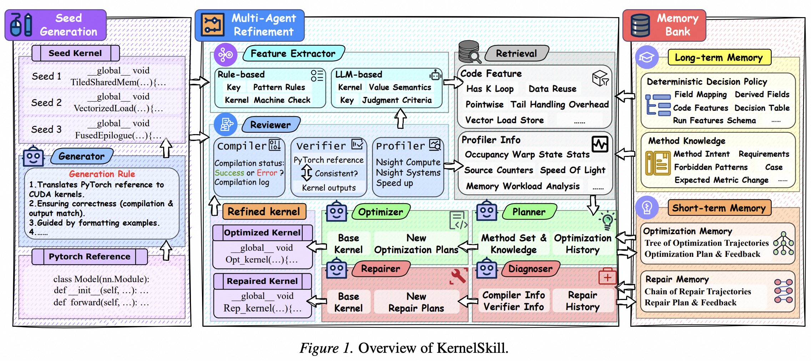

# KernelSkill: A Multi-Agent Framework for GPU Kernel Optimization

**Authors**: Qitong Sun, Jun Han, Tianlin Li, Zhe Tang, Sheng Chen, Fei Yang, Aishan Liu, Xianglong Liu, Yang Liu  
**Institution**: Tsinghua University and collaborators  
**Conference**: arXiv  
**Year**: 2026  
**Paper Link**: [arXiv:2603.10085](https://arxiv.org/abs/2603.10085)  
**GitHub**: [0satan0/KernelMem](https://github.com/0satan0/KernelMem)  

Memory Bank
Multi-Agent
KernelBench

## Background

KernelSkill is motivated by a practical weakness in many LLM-based kernel optimizers: they leave optimization-method selection to opaque model-internal heuristics. In real kernel engineering, that is a poor fit. Profiling outputs are noisy, bottlenecks shift over time, and many optimizations only make sense when certain structural and runtime preconditions hold. Without explicit knowledge and memory, multi-round refinement tends to waste iterations on mismatched strategies or repeat unproductive repairs.

The paper proposes an alternative: externalize expert optimization skills and make the optimization process trajectory-aware. Instead of relying on the model to implicitly remember what worked before, KernelSkill introduces a dual-level memory architecture that separates reusable cross-task expertise from per-task short-term refinement state.

**Key Takeaways**

- KernelSkill replaces implicit optimization heuristics with explicit, retrievable optimization skills.
- The framework combines long-term cross-task memory with short-term task-local memory to stabilize both repair and optimization.
- On KernelBench Levels 1–3, KernelSkill reports 100% success and average speedups of 5.44x, 2.82x, and 1.92x over Torch Eager.

## Methodology

KernelSkill is a closed-loop multi-agent optimizer. A Generator first produces a correct but not necessarily fast CUDA implementation from a PyTorch reference. A Reviewer then compiles, verifies, and profiles the kernel. Once correctness is established, a Feature Extractor derives static code features, while profiling tools contribute runtime evidence. These signals are used to retrieve candidate optimization methods from long-term memory. A Planner selects and sequences methods, and the Optimizer or Repairer applies them. If compilation or correctness fails, a Diagnoser reasons over the failure and the system iterates again.

The key architectural contribution is the Memory Bank. Long-term memory stores reusable expert knowledge in a structured, auditable form: normalized profiling fields, derived features, bottleneck rules, method-decision tables, and method-specific implementation guidance. Short-term memory tracks what happened in the current task, including failed repair attempts and already-tried optimization methods, so the system avoids oscillating between the same bad edits.

### System Overview

| Agent / Module | Input | Output | Role |
| --- | --- | --- | --- |
| Generator | PyTorch reference program | Initial CUDA implementation | Produces diverse correct starting kernels without optimizing for speed |
| Feature Extractor | Kernel source code | Static code features | Captures structural properties needed for method retrieval |
| Reviewer | Candidate kernel | Compile status, correctness result, profiling signals | Provides execution feedback for repair and optimization |
| Diagnoser | Compiler / verifier feedback | Root-cause diagnosis and repair ideas | Drives iterative correction when code fails |
| Planner | Retrieved methods, profiling evidence, short-term memory | Stepwise optimization plan | Selects and orders candidate optimizations |
| Optimizer / Repairer | Current kernel and plan | Edited kernel | Realizes optimization or repair actions in code |

### Dual-Level Memory Bank

| Memory Type | Stored Information | Main Purpose |
| --- | --- | --- |
| Long-term Memory | Expert optimization rules, bottleneck-method mappings, rationales, implementation cues | Cross-task method retrieval and interpretable decision making |
| Short-term Memory | Per-task repair history, attempted methods, observed outcomes | Prevents repeated backtracking and stabilizes multi-round refinement |

### Long-Term Memory Workflow

| Step | Function |
| --- | --- |
| Input aggregation | Collect NCU metrics, runtime features, and code features |
| Metric normalization | Standardize raw profiler keys via `field_mapping` |
| Derived-field computation | Build higher-level indicators from raw signals |
| Headroom tier assignment | Estimate remaining optimization potential |
| Bottleneck identification | Match the kernel to bottleneck signatures |
| Case matching | Select method candidates via decision rules |
| Global rule enforcement | Remove unsafe or invalid optimization actions |
| Method retrieval + LLM assist | Return candidate methods with rationales and implementation guidance |

## Experiment

### Experimental Setup

| Item | Value |
| --- | --- |
| Benchmark | KernelBench Levels 1–3 |
| Main Baselines | STARK, QiMeng, Astra, PRAGMA, CudaForge, Kevin-32B |
| Backbone Model | ChatGPT-5.1 in the reported best setting |
| Main Metrics | Success rate, average speedup over Torch Eager, Fast1 |
| Round Budget | 15 refinement rounds for KernelSkill in the main comparison |
| Feedback Signals | Compiler output, verifier result, NCU profiling, runtime features, static code features |

### Headline Results

| Level | Success | Average Speedup over Torch Eager |
| --- | --- | --- |
| Level 1 | 100% | 5.44x |
| Level 2 | 100% | 2.82x |
| Level 3 | 100% | 1.92x |

KernelSkill reaches 100% success on all three KernelBench levels while also delivering the best average speedup reported in the paper. The combination matters: several baselines can either be fast on easy cases or remain reliable on hard ones, but KernelSkill is presented as the method that sustains both properties together.

### Comparison Against Strong Baselines

| Comparison | Reported Difference |
| --- | --- |
| vs. STARK on Level 1 | 5.44x vs. 3.03x |
| vs. STARK on Level 2 | 2.82x vs. 2.69x |
| vs. STARK on Level 3 | 1.92x vs. 1.58x |
| vs. profiling-grounded multi-agent baselines | Consistently higher speedups on Levels 1–3 |
| vs. training-centric baselines on harder tasks | More stable success and stronger optimization under increasing difficulty |

The paper emphasizes that KernelSkill is not just marginally better. On Level 1 the gain over STARK is especially large, while on harder tasks the value of explicit memory appears in the framework’s ability to maintain both correctness and meaningful speedup rather than collapsing under noisy refinement loops.

### Ablation on Memory

| Variant | Main Finding |
| --- | --- |
| w/o memory | Lower reliability and weaker optimization because the system loses both reusable guidance and trajectory state |
| w/o long-term memory | Smaller speedup gains because method selection becomes less targeted |
| w/o short-term memory | Success drops below 100% because repair and refinement become unstable and repetitive |

The ablation results support the paper's main claim that the two memory layers solve different problems. Long-term memory improves strategic method choice across tasks, while short-term memory prevents cyclical failures and repeated low-value attempts within a task.

## Limitation

KernelSkill is strong precisely because it introduces explicit memory and more structure than ordinary prompting. That also means its benefits depend on the quality and coverage of the stored optimization knowledge.

| Limitation | Why It Matters |
| --- | --- |
| Long-term memory coverage matters | If no relevant case is retrieved, the method falls back toward weaker LLM-only decision making |
| Memory curation is nontrivial | The quality of the deterministic policy and method knowledge depends on careful expert distillation |
| More structure means more system complexity | Multi-agent coordination plus dual memory is harder to build and maintain than simple prompt loops |
| Benchmark results may depend on rule quality | Success can improve because the memory bank captures the benchmark’s common bottleneck-to-method patterns well |
| Retrieval quality is now a central bottleneck | A memory-augmented system can still fail if it retrieves the wrong method family for the current kernel |

---

*Reading date: 2026-04*
*Note status: Completed*
