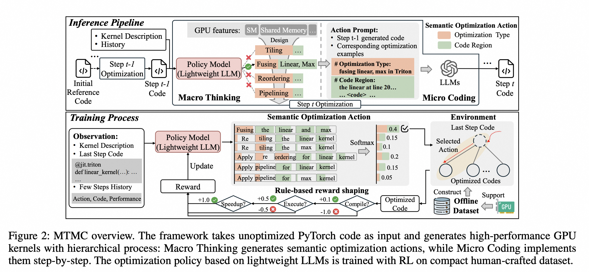

# QiMeng-Kernel: Macro-Thinking Micro-Coding Paradigm for LLM-Based High-Performance GPU Kernel Generation

**Authors**: Xinguo Zhu, Shaohui Peng, Jiaming Guo, Yunji Chen, Qi Guo, Yuanbo Wen, Hang Qin, Ruizhi Chen, Qirui Zhou, Ke Gao, Yanjun Wu, Chen Zhao, Ling Li  
**Institution**: Institute of Software, CAS; Institute of Computing Technology, CAS; University of Chinese Academy of Sciences  
**Conference**: arXiv  
**Year**: 2025  
**Paper Link**: [arXiv:2511.20100](https://arxiv.org/abs/2511.20100)  

Hierarchical Generation
Triton
KernelBench

## Background

QiMeng-Kernel studies a failure mode common to nearly all LLM-based GPU kernel generators: direct end-to-end generation of a fully optimized low-level kernel forces the model to solve two difficult problems at once. It must decide *what* optimization strategy to apply and also *how* to implement it correctly in low-level code. The paper argues that existing methods fail because these two search spaces are both large and tightly coupled, which creates a correctness-efficiency trade-off.

The proposed solution is `Macro Thinking Micro Coding` (MTMC), a hierarchical generation paradigm that decouples high-level optimization policy from low-level implementation. The goal is to let a small RL-trained policy model search over semantic optimization steps, while a stronger general-purpose LLM executes those steps one by one. This is meant to preserve correctness through localized edits while still enabling hardware-aware optimization.

**Key Takeaways**

- MTMC separates kernel generation into semantic optimization planning and stepwise code implementation.
- Macro Thinking trains a lightweight policy with RL on a compact offline optimization dataset instead of relying on massive kernel finetuning corpora.
- On KernelBench and TritonBench, MTMC reports large gains in both correctness and speed, including near-100% accuracy on KernelBench Levels 1-2 and strong improvements over Kevin-32B and KernelLLM.

## Methodology

MTMC consists of two tightly coupled stages. Macro Thinking selects an optimization action such as tiling, fusion, reordering, or pipelining on a specific code region. Micro Coding then implements that action using a strong code LLM. The system iterates until a terminal action or step limit is reached.

### System Overview

| Component | Input | Output | Role |
| --- | --- | --- | --- |
| Macro Thinking | Current kernel code, kernel description, optimization history, hardware info | Semantic optimization action | Chooses the next hardware-aware optimization step |
| Semantic Action Space | Optimization type + candidate code region | Structured action | Narrows the search space to valid, meaningful kernel transformations |
| Micro Coding | Previous-step kernel, chosen action, examples for that action type | Updated kernel code | Implements one atomic optimization with higher correctness than full-kernel synthesis |
| Offline RL Environment | 60k optimization trajectories over representative GPU tasks | Tree-structured transition system | Enables fast policy training without online LLM-in-the-loop latency |
| Reward Shaping | Compile status, correctness, runtime improvement, step decay | PPO training signal | Guides the policy from valid edits toward faster kernels while discouraging loops |

### Macro Thinking

Macro Thinking treats optimization as a sequential decision problem. The policy model is a lightweight LLM such as `DeepSeek-Coder-1.3B`, `Llama-3.2-1B`, or `Qwen2.5-1.5B`. Rather than generating code directly, it emits a semantic action:

- optimization type: `tiling`, `fusion`, `reordering`, `pipeline`, etc.
- target code region: a syntactically and semantically valid region identified from AST and data-flow analysis

This abstraction matters because it compresses the search space. The policy only needs to learn *which* optimization to apply and *where*, not write the final implementation tokens itself.

### Micro Coding

Micro Coding takes the semantic action and converts it into concrete low-level kernel changes. Its prompt is built from:

- previous-step kernel code
- the semantic action from Macro Thinking
- examples corresponding to that optimization type

Because each step is atomic and localized, the model avoids the error rate of one-shot whole-kernel generation. This is the key correctness argument of the paper.

### Training Design

| Design Choice | Purpose | Effect |
| --- | --- | --- |
| Lightweight policy RL | Learn optimization strategy efficiently | Avoids needing huge domain-specific finetuning corpora |
| PPO with TWOSOME | Stable policy optimization | Trains the semantic planner instead of the code generator |
| 60k offline trajectories | Build a reusable optimization environment | Removes expensive real-time LLM interaction during policy learning |
| Rule-based reward shaping | Gradually prioritize valid, correct, and faster kernels | Helps exploration start from compilation and move toward performance |
| Step-proportional reward decay | Penalize degenerate loops | Prevents endless optimization wandering |

## Experiment

### Experimental Setup

| Item | Value |
| --- | --- |
| Benchmarks | KernelBench and TritonBench |
| Hardware | V100, A100, H100 |
| Macro Thinking Models | DeepSeek-Coder-1.3B, Llama-3.2-1B, Qwen2.5-1.5B |
| Micro Coding Models | Gemini 2.5 Pro / Flash, Claude Sonnet 4, OpenAI o4-mini, DeepSeek-V3, DeepSeek-R1 |
| Main Metrics | Execute Accuracy, `fast_1`, `fast_2`, Mean Speedup |
| Baselines | General-purpose LLMs, Gemini CLI, Kevin-32B, KernelLLM, expert-optimized PyTorch Eager |

### Headline Results on KernelBench

| Hardware / Micro Model | Level 1 | Level 2 | Level 3 |
| --- | --- | --- | --- |
| H100 + Gemini 2.5 Pro + Ours | `100%`, `2.08x` | `99%`, `1.28x` | `70%`, `0.77x` |
| A100 + Gemini 2.5 Pro + Ours | `100%`, `2.20x` | `99%`, `1.22x` | `70%`, `0.73x` |
| V100 + Gemini 2.5 Pro + Ours | `99%`, `1.94x` | `100%`, `1.04x` | `70%`, `0.65x` |

The main pattern is strong and consistent: MTMC gets near-perfect correctness on Levels 1-2 across all three GPU generations and still keeps a sizable advantage on the much harder Level 3 tasks. Compared with direct LLM baselines, the method is less random and much less sensitive to hardware generation.

### Comparison Against Prior Kernel Models

| Comparison | Reported Gain |
| --- | --- |
| vs. Kevin-32B on H100 | `+32% / +31% / +22%` accuracy on KernelBench Levels 1/2/3 with up to `8.41x` mean-speedup gain on Level 3 |
| vs. KernelLLM on H100 | `+59% / +64% / +60%` accuracy on KernelBench Levels 1/2/3 with up to `8.56x` mean-speedup gain on Level 3 |
| vs. KernelLLM on TritonBench-T | `+59.64%` call accuracy and `+50.60%` execute accuracy with about `32x` mean-speedup gain |

These comparisons are the paper's most important empirical evidence. MTMC is not only better than generic frontier LLMs, but also clearly stronger than domain-finetuned baselines such as Kevin-32B and KernelLLM. The paper attributes this to the decoupled structure rather than to bigger models or larger kernel datasets.

### TritonBench and Ablations

| Setting | Main Finding |
| --- | --- |
| TritonBench-T with Gemini 2.5 Flash + Ours | `64.46%` call accuracy, `54.82%` execute accuracy, `0.64x` mean speedup |
| Target language ablation | MTMC can also generate CUDA kernels well on matmul-style operators, though Triton remains the easier main target |
| Micro Coding ablation (`w/o Hier`) | Removing hierarchical stepwise implementation causes large drops, e.g. on KernelBench Level 2 from `97% / 1.21x` to `32% / 0.43x` |
| Macro Thinking ablation | RL-trained policy and hardware-aware action space are both necessary; direct unrestricted LLM suggestions degrade sharply |

The ablation results support the paper's core claim. The gain does not come from prompt engineering alone. It comes from both pieces together:

- learned policy over structured optimization actions
- incremental implementation instead of one-shot kernel synthesis

## Limitation

The paper's results are strong, but the scope and evidence still have some boundaries.

| Limitation | Why It Matters |
| --- | --- |
| Main focus is still GPU/Triton generation | The framework is promising, but broader languages and hardware backends remain future work |
| Network-level kernels are less mature | The paper says MTMC already improves them, but still highlights this as an area for further improvement |
| Offline training environment abstracts Micro Coding latency | This makes policy training practical, but it is still a proxy for the full online generation loop |
| Semantic action space is expert-derived | The framework reduces search complexity, but part of that advantage comes from curated optimization priors |
| Level 3 remains harder than Levels 1-2 | Accuracy around `70%` is strong, but still well below the near-perfect results on simpler tasks |

---

*Reading date: 2026-04*
*Note status: Completed*
