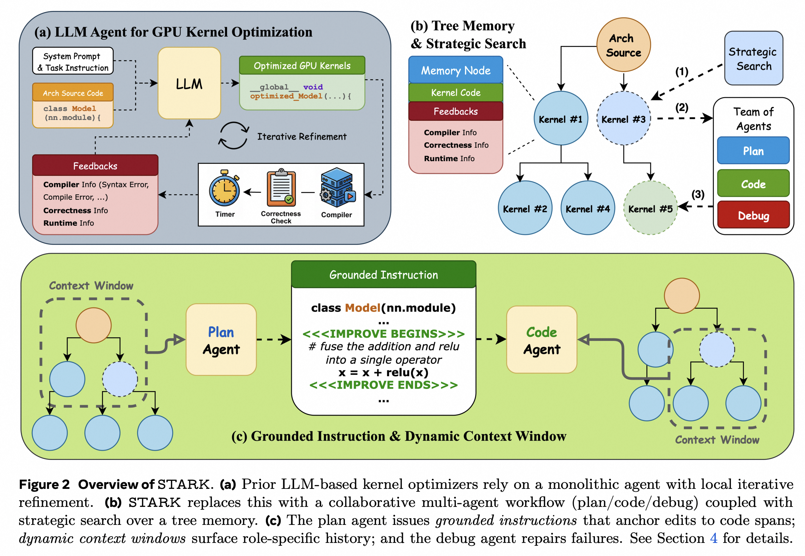

# STARK: Strategic Team of Agents for Refining Kernels

**Authors**: Juncheng Dong, Yang Yang, Tao Liu, Yang Wang, Feng Qi, Vahid Tarokh, Kaushik Rangadurai, Shuang Yang  
**Conference**: arXiv  
**Year**: 2025  
**Paper Link**: [arXiv:2510.16996](https://arxiv.org/abs/2510.16996)  

Multi-Agent Systems
KernelBench
GPU Kernel Optimization

## Background

STARK studies automated GPU kernel optimization as a long-horizon search problem rather than a one-shot code generation task. The target setting is KernelBench, where each problem starts from a PyTorch reference and asks the optimizer to produce a correct custom GPU kernel with lower wall-clock runtime. This makes the task harder than ordinary code synthesis: the system must preserve semantics, compile successfully, and reason about architecture-dependent performance trade-offs.

The paper identifies three recurring weaknesses in earlier LLM-based kernel optimizers. First, linear refinement only learns from the latest attempt and ignores broader search history. Second, a single monolithic agent must handle planning, code writing, and debugging at once, even though those subtasks require different behaviors. Third, even when an LLM proposes a plausible optimization strategy, it often fails to realize that plan as valid low-level CUDA code. STARK addresses all three issues by combining role-specialized agents, explicit plan-to-code grounding, and a search policy over a persistent memory tree.

**Key Takeaways**

- STARK decomposes kernel optimization into planning, coding, and debugging roles instead of relying on one generalist agent.
- The system uses grounded edit anchors and role-specific context windows to reduce the gap between high-level optimization ideas and executable CUDA kernels.
- On a representative subset of KernelBench with a 30-attempt budget, STARK reports higher success and substantially higher speed than Sampling and Reflexion baselines across Levels 1-3.

## Methodology

STARK organizes optimization around a search tree whose nodes are candidate kernels plus their evaluation outcomes. Each step selects one prior node to expand, constructs agent-specific context from local history and global leaders, proposes a targeted optimization, materializes it into code, evaluates correctness and runtime, and then inserts the result back into the tree. This turns kernel optimization into a feedback-driven search loop rather than a sequence of isolated retries.

Two ideas are central to making the multi-agent design work. Grounded instruction forces the planner to annotate the source with explicit edit spans such as `<<<IMPROVE BEGINS>>> ... <<<IMPROVE ENDS>>>`, so the code agent is not asked to reinterpret a vague natural-language plan. Dynamic context windows then expose different slices of history to different roles: the planner sees the current node, its children, and top global candidates; the coder also sees closely related cousin branches; the debugger focuses on sibling failures and fixes. The result is a division of labor that is both role-specialized and history-aware.

### System Overview

| Component | Input | Output | Role |
| --- | --- | --- | --- |
| Plan Agent | Selected node, root kernel, local children, leaderboard entries | Grounded optimization instruction | Chooses a promising transformation and anchors it to code spans |
| Code Agent | Grounded instruction, source kernel, related branch history | New CUDA kernel candidate | Translates the plan into executable kernel code |
| Debug Agent | Failing candidate, sibling attempts, diagnostics | Repaired CUDA kernel | Performs local fixes for compile/runtime/correctness failures |
| Tree Memory | Candidate kernels and observations | Search state | Stores runtime, correctness, and failure information across attempts |
| Search Policy | Tree statistics and node scores | Next node to expand | Balances exploration and exploitation under a fixed attempt budget |

### Key Design Choices

- STARK separates creative planning from precise code realization by using different agent roles and different temperatures.
- The search state is persistent: every attempt remains available as a node with runtime and correctness feedback.
- The selection rule is an adapted `epsilon`-greedy policy with root throttling, dead-branch pruning, and leaf-biased exploration.
- Grounded instruction narrows the coder's edit scope and improves traceability between plan and implementation.
- Dynamic context windows are role-specific instead of exposing the same history to every agent.

### Search and Coordination Mechanics

| Mechanism | What It Does | Why It Matters |
| --- | --- | --- |
| Multi-Agent Design | Splits optimization into plan, code, and debug roles | Matches different subtasks to different prompting behavior |
| Grounded Instruction | Marks exact source spans for edits | Reduces plan-code mismatch and hallucinated rewrites |
| Dynamic Context Window | Builds planner/coder/debugger-specific history views | Surfaces relevant prior attempts without overloading the prompt |
| Tree Memory | Stores parent-child candidate relationships | Enables reuse of failed and successful search trajectories |
| Adapted `epsilon`-greedy Search | Mixes best-node expansion with exploratory leaf selection | Avoids myopic refinement and repeated root-level retries |

## Experiment

### Experimental Setup

| Item | Value |
| --- | --- |
| Benchmark | KernelBench representative subset |
| Task Levels | Level 1, Level 2, Level 3 |
| Hardware | NVIDIA A100 40GB |
| Base Model | Claude Sonnet 4 |
| Agent Temperatures | Plan `tau=0.8`, Code/Debug `tau=0.1` |
| Attempt Budget | 30 attempts per task |
| Runtime Measurement | CUDA events after 100 warm-up runs with fixed shapes |
| Baselines | Torch Eager, `torch.compile` default, `torch.compile` max-autotune, Sampling Agent, Reflexion Agent |
| Main Metrics | Success rate, `Fast_1` rate, average speed ratio |

### Headline Results

| Level | Method | Success | `Fast_1` vs Torch Eager | Speed vs Torch Eager |
| --- | --- | --- | --- | --- |
| 1 | Sampling | 57.1% | 14.3% | 0.81x |
| 1 | Reflexion | 92.6% | 28.6% | 1.24x |
| 1 | STARK | 100% | 71.4% | 3.03x |
| 2 | Sampling | 87.5% | 50.0% | 1.06x |
| 2 | Reflexion | 100% | 75.0% | 0.88x |
| 2 | STARK | 100% | 100% | 2.69x |
| 3 | Sampling | 100% | 50.0% | 0.87x |
| 3 | Reflexion | 67.5% | 25.0% | 0.79x |
| 3 | STARK | 100% | 87.5% | 1.58x |

The main pattern is that STARK improves both reliability and speed simultaneously. Reflexion can often compile and sometimes remain correct, but it frequently lands below Torch baselines on runtime. STARK is different: it keeps full success on all three levels in the reported subset while also moving a much larger fraction of tasks above the Torch baselines, especially on the harder Level 2 and Level 3 problems.

### Compile and Correctness Analysis

| Agent | Compile Rate L1/L2/L3 | Correct Rate L1/L2/L3 |
| --- | --- | --- |
| Sampling | 90.8% / 97.0% / 84.9% | 43.0% / 44.0% / 15.1% |
| Reflexion | 86.0% / 86.2% / 78.9% | 48.3% / 53.4% / 28.4% |
| STARK | 84.5% / 90.7% / 83.4% | 50.6% / 61.2% / 35.5% |

This table explains why STARK wins even without having the highest compile rate. The gain is not simply "more code compiles"; the gain is that a larger share of compiled kernels are also semantically correct. That fits the paper's main thesis that planning, grounded edits, and targeted debugging reduce wasted attempts on superficially plausible but wrong kernels.

### Ablation Results

| Method | `Fast_1` vs Torch Eager | Speed vs Torch Eager | `Fast_1` vs Default Compile | Speed vs Default Compile |
| --- | --- | --- | --- | --- |
| Sampling Agent | 50.0% | 0.87x | 12.5% | 0.67x |
| Search Agent | 67.5% | 0.89x | 25.0% | 0.71x |
| MA-Only | 67.5% | 1.11x | 25.0% | 0.92x |
| STARK | 87.5% | 1.58x | 87.5% | 1.27x |

The ablation indicates that search and multi-agent coordination each help on their own, but neither is sufficient alone. Search without the full multi-agent workflow finds more valid branches yet still struggles to beat strong compiled baselines. Multi-agent coordination without strategic search improves average speed more, but the combined system is the only configuration that moves both coverage and performance decisively upward.

The paper also reports relative gains over other agents measured directly on generated kernels: STARK reaches more than `10x` over Sampling on Level 1, up to `16x` over Reflexion on Level 2, and roughly `5x-6x` on Level 3. Those numbers are useful as an auxiliary signal, but the more important result is the consistent improvement against Torch baselines, since that is the actual deployment threshold for usefulness.

## Limitation

Some limitations are explicit in the paper, and others are best read as evidence constraints from the evaluation.

| Limitation | Why It Matters |
| --- | --- |
| Evaluation uses a representative subset of KernelBench rather than the full benchmark | It weakens claims about robustness across the entire task distribution |
| The benchmark is limited to NVIDIA A100 | Cross-architecture generalization to other GPUs or accelerators is untested |
| The method still depends on up to 30 attempts per task | Good results come from iterative search, not single-pass optimization quality |
| Correctness rates remain far below 100% at the attempt level | Many sampled branches are still invalid even when the final best result is strong |
| Multi-agent orchestration adds system complexity | The improvement may partly come from extra compute, prompt engineering, and search budget rather than purely better optimization priors |

The paper positions future work around broader operator classes, more hardware targets, and richer post-training for specific agent roles. Those directions are sensible because the current evidence shows STARK as a stronger search-and-repair framework, but not yet a universally reliable autonomous kernel optimizer.

---

*Reading date: 2026-04*
*Note status: Completed*
